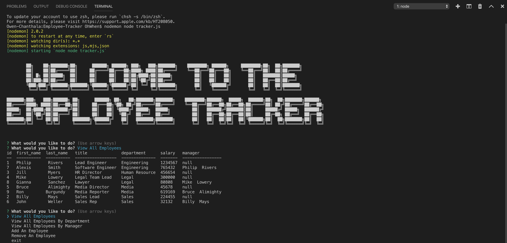

# Employee-Tracker

## Table of contents
* [Github Repo](#github-repo)
* [Assignment Info](#assignment-info)
* [Technologies](#technologies)
* [Running Pages](#running-pages)
* [Key Notes](#key-notes)

## Github Repo
* HTML
 https://github.com/ohhhhhwhen/Employee-Tracker

## Assignment info
Using mysql workbench to create tables,
than will be adjusted manually and through a
connected javascript console. Focusing on the idea
of an employee tracker to show tables with different
employee information. The console not only views the 
tables but can add and delete employee info. All while 
connecting through a local mysql database. 
	
## Technologies
Project is created with:
* Bootstrap v4.4
* Visual Studios Code (HTML/CSS/JS/JQ)
* Google/W3
* Node.js
* Express
* NPM
* MySQL
	
## Running Pages
* Here is a screen shot of the running console from an images folder:

 

## Key Notes
* required packages 

```
$ const mysql = require("mysql");
$ const inquirer = require("inquirer");
$ const cTable = require("console.table");
```

*  NPM
- install
- require
- inquirer
- nodemon
- mysql
- console.table